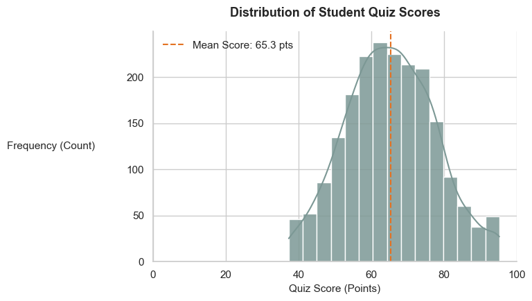
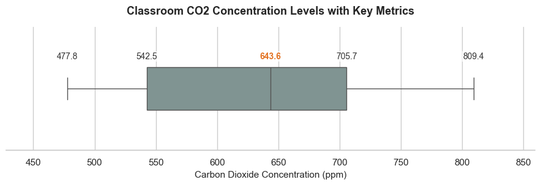
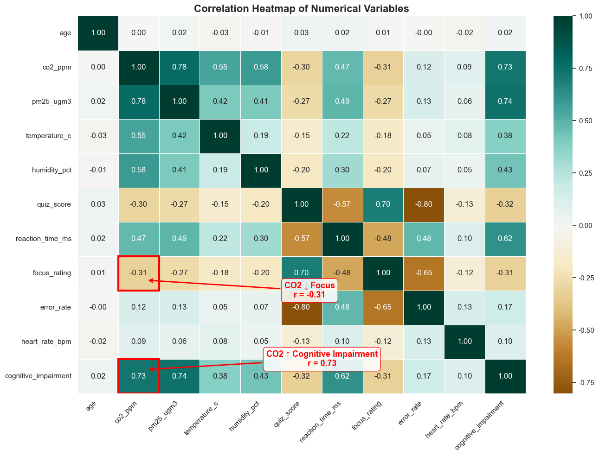
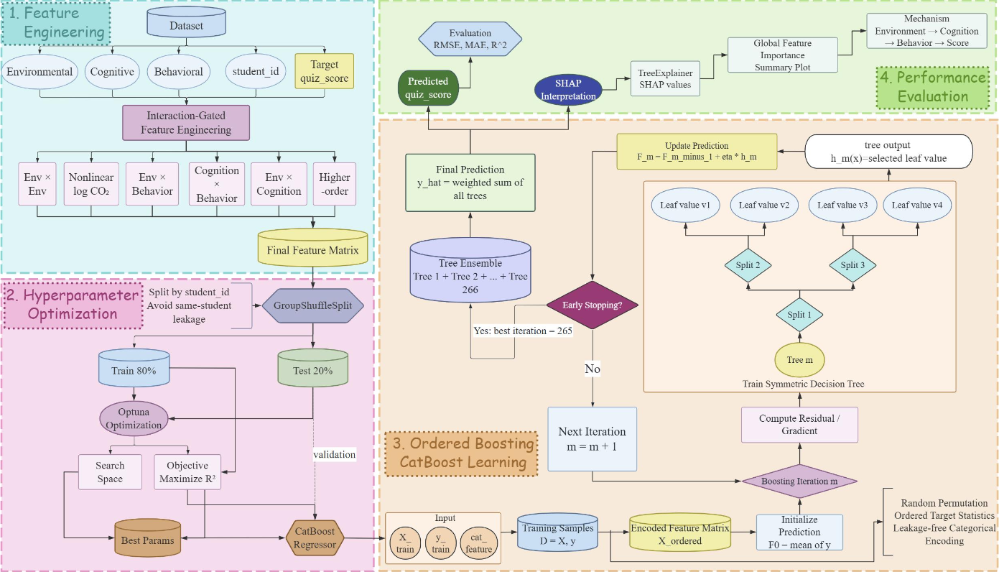
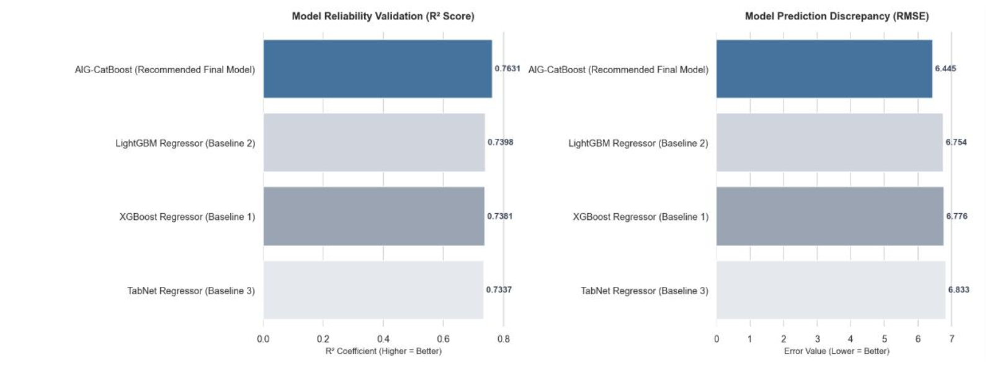
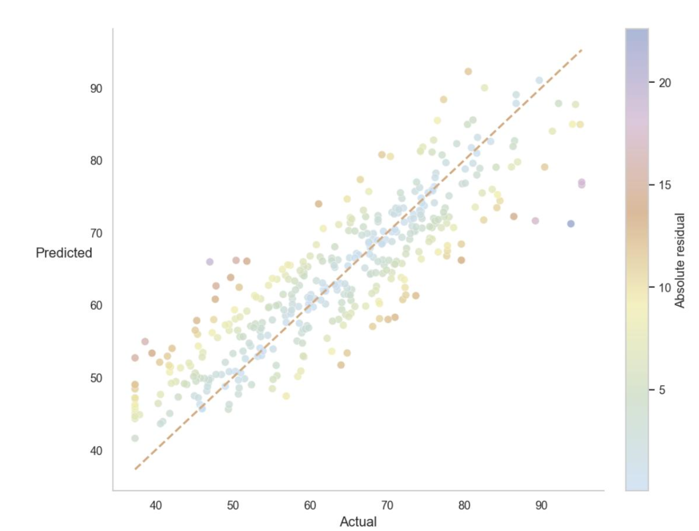
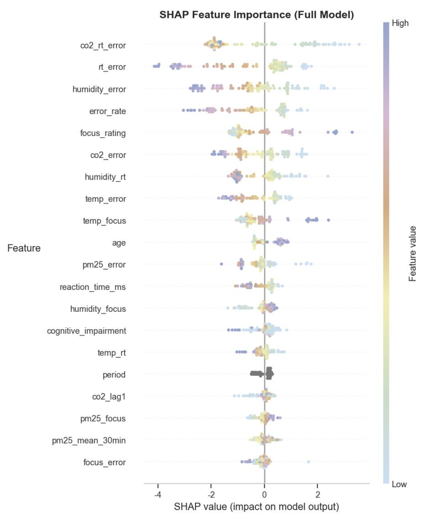
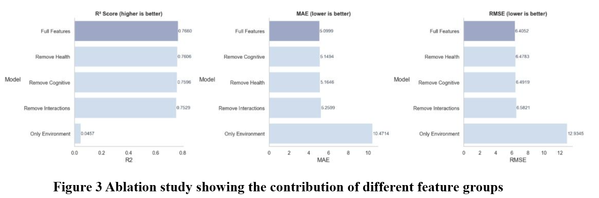
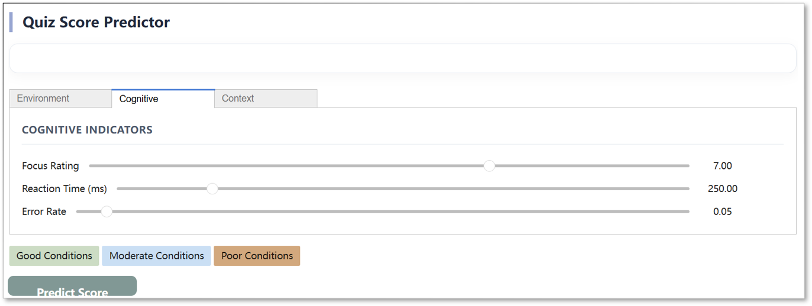
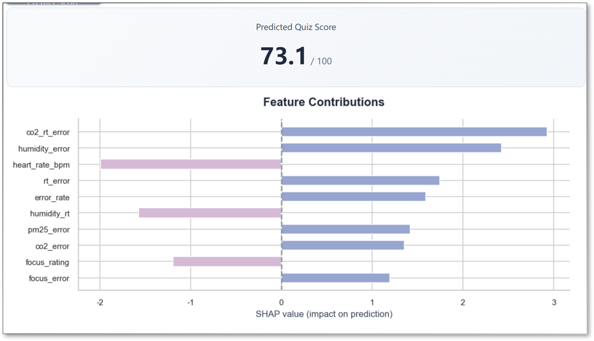

# Predicting Student Quiz Performance through Environmental and Cognitive Analysis Using Adaptive Interaction-Gated CatBoost

INFO 442 Final Deployment, Report & Presentation  
Group 6

---

## 1. Introduction

Indoor environmental quality has become an important topic in educational data science because classroom conditions may influence students' cognitive performance and learning outcomes. Environmental variables such as **CO₂ concentration**, **PM2.5**, **temperature**, **humidity**, and perceived air quality affect attention, reaction speed, and decision-making, which may ultimately influence academic achievement. Rather than relying on fixed environmental thresholds, this study models these complex relationships using machine learning.

The objective is to predict **student quiz scores** from classroom environmental measurements together with demographic, cognitive, behavioral, and health-related variables. Since environmental effects are often indirect, interaction relationships between environmental exposure and student cognition are explicitly modeled.

This study proposes an **Adaptive Interaction-Gated CatBoost (AIG-CatBoost)** framework consisting of three components:

- Interaction Feature Generation
- Pipeline-based Preprocessing and Feature Selection
- CatBoost Regressor

The project addresses four research questions:

1. Can environmental and cognitive variables accurately predict quiz scores?
2. Which feature groups contribute most to prediction?
3. Do interaction features improve performance?
4. Does AIG-CatBoost outperform common tabular learning models?

The workflow includes exploratory analysis, preprocessing, feature engineering, model development, hyperparameter optimization, evaluation, ablation study, SHAP interpretation, and Streamlit deployment. Model performance is evaluated using **MAE**, **RMSE**, and **R²**.


*Figure 1. Research Framework.*

## 2. Dataset & Exploratory Data Analysis

### 2.1 Dataset Description

The study uses the **Air Quality and Student Performance Dataset** from Kaggle, containing **2,000 classroom observations**. Each record combines classroom environmental conditions, student characteristics, cognitive and behavioral measurements, and academic performance.

The prediction target is **quiz_score (0–100)**, formulated as a regression task to preserve continuous performance information.

The dataset contains **28 variables**, including environmental, cognitive, behavioral, demographic, contextual, and health-related features.

| Feature Group | Example Variables | Description |
|---|---|---|
| Environmental | `co2_ppm`, `pm25_ugm3`, `temperature_c`, `humidity_pct`, `air_quality_label` | Classroom physical and air-quality measurements |
| Cognitive | `focus_rating`, `cognitive_impairment` | Indicators of attention and cognitive state |
| Behavioral | `reaction_time_ms`, `error_rate` | Task execution speed and mistakes |
| Health-related | `has_asthma`, `heart_rate_bpm` | Physiological and health-related information |
| Demographic / Contextual | `age`, `grade`, `subject`, `day`, `period` | Student background and learning session context |
| Target | `quiz_score` | Continuous academic performance outcome |

*Table 1. Dataset Summary.*

The dataset contains:

- 2,000 observations
- 28 variables
- 20 numerical features
- 8 categorical features
- 0 missing values
- 0 duplicate records

Extreme environmental observations, especially high CO₂ concentrations, were retained because they represent realistic poorly ventilated classroom conditions.

### 2.2 Data Cleaning and Leakage Prevention

To avoid target leakage, three variables were removed before modeling:

- `student_id`
- `performance_label`
- `iso_outlier`

All preprocessing operations were implemented through a unified pipeline so that identical transformations are applied during both training and deployment.

### 2.3 Univariate Analysis

Quiz scores follow an approximately normal distribution, making regression appropriate.



*Figure 2. Distribution of Quiz Scores.*

CO₂ concentration shows considerable variation, with several high-value observations representing poor classroom ventilation. These observations were retained because they correspond to realistic environmental conditions.



*Figure 3. Classroom CO₂ Distribution.*

Air-quality categories are moderately imbalanced, with most observations belonging to better environmental conditions.

### 2.4 Bivariate Analysis

CO₂ concentration exhibits a statistically significant negative relationship with quiz performance.

- **CO₂ vs Quiz Score:** **r = −0.296**
- **CO₂ vs Reaction Time:** **r = 0.471**

Higher CO₂ concentration is associated with lower quiz scores and slower reaction times, suggesting that environmental quality may influence academic performance through cognitive efficiency.

Students exposed to better air quality generally achieved higher average quiz scores than those in poorer classroom environments.

### 2.5 Multivariate Analysis

The correlation heatmap shows that cognitive and behavioral variables have stronger direct relationships with quiz performance than environmental variables.

- **Focus Rating** → strong positive correlation
- **Reaction Time** → negative correlation
- **Error Rate** → negative correlation



*Figure 4. Correlation Heatmap.*

The analysis suggests the following mechanism:

```text
Classroom Environment
        ↓
Student Cognition
        ↓
Behavioral Response
        ↓
Quiz Performance
```

Environmental variables therefore contribute primarily through interaction with cognitive and behavioral features, motivating the interaction-aware design of the proposed AIG-CatBoost model.

## 3. Feature Engineering

Feature engineering is critical because environmental variables rarely affect academic performance directly. Instead, they interact with cognitive and behavioral states, making nonlinear modeling necessary.

The design follows three principles:
- Features must have interpretability in educational or environmental context
- Interaction terms should reflect domain knowledge
- All transformations must be reproducible via pipeline

### 3.1 Integrated Preprocessing Pipeline

A unified preprocessing pipeline ensures consistency between training and deployment.

Pipeline stages:
1. Data validation
2. Leakage removal
3. Feature construction
4. Encoding & scaling
5. Feature selection

Implemented using **Scikit-learn Pipeline + ColumnTransformer**, ensuring full reproducibility.

### 3.2 Missing Value Handling and Data Quality

Although the final dataset contained no missing values, three imputation strategies (Median/Mode, KNN and MICE) were benchmarked during preprocessing. KNN achieved the highest cross-validation stability and was selected as the default strategy for robustness：

- Median/Mode Imputation
- KNN Imputation
- MICE (Multiple Imputation by Chained Equations)

**Result:** KNN Imputation performed best in cross-validation stability.

Outlier detection methods used:
- IQR
- Z-score
- MAD
- Isolation Forest


*Figure 5. Isolation Forest Diagnostics.*

Environmental extreme values (e.g., high CO₂) were retained if physically plausible because they represent meaningful classroom stress conditions.

### 3.3 Interaction Feature Engineering

Interaction features capture compound environmental and behavioral effects.

#### Environmental interactions
- `co2_x_temperature`
- `co2_x_humidity`
- `temperature_x_humidity`

#### Environment–behavior interactions
- `co2_x_reaction_time`
- `pm25_x_reaction_time`
- `temperature_x_error_rate`

#### Behavioral interactions
- `reaction_time_x_error_rate`
- `focus_rating_x_error_rate`

#### Higher-order interactions
- `co2_x_reaction_time_x_error_rate`

These features encode nonlinear environmental stress effects on cognition and behavior.

### 3.4 Temporal Feature Construction

Temporal effects reflect cumulative exposure.

Key features:
| Feature | Description |
|---|---|
| `co2_mean_30min` | 2-period rolling mean |
| `co2_mean_60min` | 4-period rolling mean |
| `co2_lag1` | Previous value |
| `delta_co2` | Change rate |
| `co2_trend` | Directional trend |

Grouped computation ensures no cross-student leakage.

### 3.5 Feature Gate

Instead of treating feature selection as a separate standalone model component, this project integrates feature filtering and transformation into the preprocessing pipeline. The preprocessing workflow uses Scikit-learn Pipeline and ColumnTransformer to ensure consistent transformation of numerical and categorical variables, prevent leakage, and preserve reproducibility between training and deployment.

The feature selection process mainly serves three purposes:

- remove leakage-prone variables such as `student_id`, `performance_label`, and `iso_outlier`;
- retain engineered temporal and interaction features that are theoretically meaningful;
- reduce noisy or redundant predictors before model training.

Therefore, the final AIG-CatBoost framework should be understood as an interaction-enhanced CatBoost model supported by a unified preprocessing and feature-engineering pipeline, rather than a model with a separate independently implemented feature gate.

## 4. Methodology

This is a regression problem predicting **quiz_score (0–100)**.

Five models are evaluated under identical conditions.

### 4.1 Baseline Models

Three baseline regression models were evaluated:

- **XGBoost:** Gradient boosting trees for nonlinear learning.
- **LightGBM:** Efficient histogram-based gradient boosting.
- **TabNet:** Attention-based deep learning model for tabular data.

### 4.2 Adaptive Interaction-Gated CatBoost

Proposed framework:

1. Interaction feature generation
2. Pipeline-based preprocessing and leakage-variable removal
3. CatBoost training
4. SHAP interpretation



*Figure 6. Adaptive Interaction-Gated CatBoost Framework.*

Advantages:
- Captures nonlinear environmental interactions
- Reduces feature noise
- Improves interpretability

### 4.3 Hyperparameter Optimization

Optimized using **Optuna (Bayesian optimization)**.

Search space:
- Tree depth
- Learning rate
- L2 regularization
- Bagging temperature
- Random strength
- Iterations

Early stopping is applied to prevent overfitting.

## 5. Experimental Setup

### 5.1 Task Definition

Supervised regression task:
- Input: environmental + cognitive + behavioral + demographic features
- Output: quiz_score (0–100)

### 5.2 Train-Test Split

- 80% training / 20% testing
- 1,592 training samples
- 408 testing samples
- Split by **GroupShuffleSplit (student_id)**

```text
Training: 1592
Testing : 408
Split   : 80/20
Group   : student_id
```

### 5.3 Evaluation Metrics

#### MAE
\[
MAE = \frac{1}{n}\sum |y - \hat{y}|
\]

#### RMSE
\[
RMSE = \sqrt{\frac{1}{n}\sum (y - \hat{y})^2}
\]

#### R²
\[
R^2 = 1 - \frac{\sum (y - \hat{y})^2}{\sum (y - \bar{y})^2}
\]

| Metric | Meaning |
|---|---|
| MAE | Average error |
| RMSE | Penalizes large errors |
| R² | Variance explained |


*Table 2. Evaluation Metrics.*

### 5.4 Experimental Protocol

Pipeline:
```text
Raw Data
→ Leakage Removal
→ Feature Engineering
→ Train/Test Split
→ Model Training
→ Hyperparameter Tuning
→ Evaluation
→ SHAP Interpretation
```

All models use identical preprocessing for fairness.

## 6. Results & Discussion

### 6.1 Final Model Performance

The proposed **AIG-CatBoost** achieved the best predictive performance on the independent test set.

| Metric | Value |
|---|---:|
| MAE | **5.12201** |
| RMSE | **6.44481** |
| R² | **0.76309** |

*Table 3. Final AIG-CatBoost Performance.*

The model explains approximately **76.3%** of the variance in student quiz scores. The average prediction error is approximately **5.12 points**, which is acceptable for classroom-level prediction and educational decision support.

The RMSE is slightly higher than the MAE, indicating that a relatively small number of observations exhibit larger prediction errors. These cases mainly occur at the extreme ends of the score distribution, where student performance may be influenced by factors that are not included in the dataset, such as prior knowledge, motivation, sleep quality, emotional state, or temporary health conditions.

Overall, the results demonstrate that the proposed model provides reliable predictive performance while maintaining good generalization ability on unseen students.

### 6.2 Baseline Model Comparison

The proposed AIG-CatBoost model was compared with three representative nonlinear machine learning models under identical preprocessing procedures and the same train-test split.

| Model | MAE | RMSE | R² |
|---|---:|---:|---:|
| **AIG-CatBoost** | **5.12201** | **6.44481** | **0.76309** |
| XGBoost Regressor | 5.46517 | 6.77561 | 0.73815 |
| LightGBM Regressor | 5.40317 | 6.75407 | 0.73981 |
| TabNet Regressor | 5.39835 | 6.83345 | 0.73366 |

*Table 4. Model Comparison.*



*Figure 7. Model Performance Comparison.*

AIG-CatBoost consistently achieved the best performance across all evaluation metrics. Compared with XGBoost, the proposed model reduced MAE from **5.46517** to **5.12201** while increasing the coefficient of determination from **0.73815** to **0.76309**. Similar improvements were observed over both LightGBM and TabNet.

The relatively similar performance of XGBoost, LightGBM, and AIG-CatBoost indicates that gradient-boosting methods are well suited to structured educational datasets. However, the consistent advantage of AIG-CatBoost suggests that the interaction-aware feature engineering strategy enables the model to capture relationships that conventional boosting models cannot fully exploit.

TabNet produced competitive but weaker performance than the tree-based models. This result is consistent with previous findings that deep learning methods often require substantially larger tabular datasets to demonstrate clear advantages. With only 2,000 observations, boosting algorithms remain more sample-efficient and therefore achieve better predictive accuracy.

### 6.3 Model Interpretation

The superior performance of AIG-CatBoost can be explained by three complementary factors.

First, CatBoost is naturally suited to heterogeneous tabular datasets containing both numerical and categorical variables. The dataset includes environmental measurements together with contextual variables such as subject, grade, day, period, and air-quality category. CatBoost effectively models these mixed data types while reducing the need for extensive manual encoding.

Second, the engineered interaction features capture compound relationships between environmental conditions, cognitive responses, and behavioral performance. Features such as **co2_rt_error** represent situations where poor classroom ventilation, slower reaction time, and increased task errors occur simultaneously. These interaction variables contain substantially richer information than considering each variable independently.

Third, the unified preprocessing pipeline removes leakage-prone variables and applies consistent feature transformation before model training, reducing redundant information and improving model robustness throughout the training and deployment workflow.

More importantly, the modelling results validate the mechanism proposed during the exploratory data analysis. Rather than directly determining quiz performance, environmental conditions appear to influence students through an **environmental → cognitive → behavioral → academic performance** pathway. The improved performance obtained by interaction features indicates that these relationships are not purely additive but involve meaningful nonlinear interactions among different feature groups.


### 6.4 Predicted vs Actual Scores

The predicted-versus-actual plot demonstrates strong agreement between observed and predicted quiz scores. Most observations lie close to the diagonal reference line, indicating that the model provides accurate predictions across the majority of students.



*Figure 8. Predicted vs Actual Quiz Scores.*

Larger prediction errors mainly occur at the highest and lowest score ranges. Extreme academic performance is more difficult to predict because these observations are likely influenced by additional latent variables that were not measured in the current dataset, including prior knowledge, learning motivation, psychological stress, and temporary health conditions.

This limitation does not reduce the practical value of the proposed model. The objective of the system is not to perfectly estimate every individual quiz score but to identify environmental and cognitive conditions associated with lower expected academic performance. From a classroom management perspective, such predictions provide useful decision-support information for early intervention and environmental optimization.


### 6.5 SHAP-Based Model Interpretation

An ablation study was conducted to quantify the contribution of different feature groups to predictive performance.

| Model | MAE | RMSE | R² |
|---|---:|---:|---:|
| Full Features | **5.09987** | **6.40522** | **0.76599** |
| Remove Interaction Features | 5.25992 | 6.58213 | 0.75289 |
| Remove Cognitive Features | 5.14938 | 6.49189 | 0.75962 |
| Remove Health Features | 5.16460 | 6.47831 | 0.76062 |
| Environment Only | 10.47137 | 12.93455 | 0.04575 |

*Table 5. Ablation Study Results.*



*Figure 9. SHAP Summary Plot.*

Removing interaction features caused the largest decline in predictive performance among all feature groups, confirming that nonlinear interactions provide substantial predictive information beyond individual variables. Removing cognitive or health-related variables also reduced model accuracy, although the impact was less pronounced.

The environment-only model achieved an R² of only **0.04575**, demonstrating that classroom environmental measurements alone cannot adequately explain academic performance. Instead, predictive power emerges from integrating environmental conditions with cognitive and behavioral responses, supporting the central modelling hypothesis proposed in this study.

## 6.6 SHAP-Based Model Interpretation

SHAP analysis was used to explain how individual features contribute to model predictions.


*Figure 10. SHAP Summary Plot.*

The most influential variables include interaction features and behavioral indicators such as **co2_rt_error**, **rt_error**, **humidity_error**, **error_rate**, and **focus_rating**. Higher error rates and longer reaction times generally decrease predicted quiz scores, whereas higher focus ratings contribute positively to academic performance.

Environmental variables rarely dominate the model as isolated predictors. Instead, their influence becomes substantially stronger when combined with cognitive and behavioral indicators through engineered interaction features. For example, elevated CO₂ concentration alone has limited predictive power, whereas elevated CO₂ together with slower reaction time and increased task errors becomes a strong negative predictor of academic performance.

These findings are highly consistent with the exploratory data analysis presented in M4. While direct environmental correlations with quiz performance were moderate, cognitive and behavioral variables exhibited stronger associations. The SHAP analysis therefore confirms that the proposed model has learned a mediated environmental–cognitive–behavioral pathway rather than relying on simple environmental threshold effects. This agreement between the EDA findings and the final model interpretation further strengthens the credibility and interpretability of the proposed AIG-CatBoost framework.

## 7. Ablation Study

### 7.1 Ablation Design

An ablation study was conducted to evaluate the contribution of different feature groups to the final model. Each experiment used the same training/testing split and hyperparameter settings, with only the feature set changed.

The evaluated configurations were:

- Full Features
- Remove Interaction Features
- Remove Cognitive Features
- Remove Health Features
- Environment Only

### 7.2 Ablation Results

| Model Configuration | MAE | RMSE | R² |
|---|---:|---:|---:|
| **Full Features** | **5.09987** | **6.40522** | **0.76599** |
| Remove Interaction Features | 5.25992 | 6.58213 | 0.75289 |
| Remove Cognitive Features | 5.14938 | 6.49189 | 0.75962 |
| Remove Health Features | 5.16460 | 6.47831 | 0.76062 |
| Environment Only | 10.47137 | 12.93455 | 0.04575 |

*Table 6. Ablation Study Results.*



*Figure 10. Ablation Study Results.*

The complete feature set achieved the best performance (**R² = 0.76599**), confirming that combining environmental, cognitive, behavioral, health, and interaction features provides the strongest predictive capability.

Removing interaction features caused a noticeable performance decline, demonstrating that engineered interactions capture meaningful nonlinear relationships.

Removing cognitive or health-related variables also reduced model performance, although the effect was smaller.

The **Environment Only** model performed poorly (**R² = 0.04575**), indicating that environmental measurements alone cannot adequately explain quiz-score variation.

### 7.3 Discussion of Ablation Findings

The ablation study supports the central hypothesis of this project.

Environmental variables are informative but insufficient when used independently. Their predictive value becomes much stronger when combined with cognitive and behavioral information.

The significant drop after removing interaction features confirms that environmental stress is not simply additive. Instead, combinations of elevated CO₂, slower reaction time, and increased error rate provide substantially richer predictive information.

Overall, the results demonstrate that the improved performance of AIG-CatBoost comes from both the CatBoost algorithm and the integration of interaction-aware feature engineering.

## 8. Deployment

### 8.1 System Overview

To demonstrate practical applicability, a lightweight deployment prototype was developed using **Streamlit**.

The deployment workflow is:

```text
User Input
(Environment + Student Information)
        ↓
Preprocessing Pipeline
        ↓
Feature Engineering
        ↓
AIG-CatBoost Model
        ↓
Quiz Score Prediction
        ↓
SHAP Explanation
        ↓
Dashboard Visualization
```



*Figure 11. Streamlit-Based Prediction Interface.*

The interface enables teachers or administrators to input classroom environmental measurements and student information, then obtain predicted quiz scores together with model explanations.

### 8.2 Input Features

The deployed system accepts:

- Environmental variables (CO₂, PM2.5, temperature, humidity)
- Cognitive variables (focus rating, reaction time, error rate)
- Demographic variables (age, grade, subject)
- Health variables (asthma condition, heart rate)

All inputs are processed using the same preprocessing pipeline applied during model training.

### 8.3 Output and Interpretation

The deployment produces:

1. **Predicted Quiz Score (0–100)**
2. **Local SHAP Explanation**



*Figure 12. Prediction Result and Local SHAP Explanation.*

Besides predicting quiz performance, the system explains which features contribute most to each prediction, improving transparency and interpretability.

### 8.4 Practical Applications

Potential applications include:

- Real-time classroom monitoring
- Indoor ventilation optimization
- Teaching strategy adjustment
- Early warning of potential learning-performance decline

The prototype demonstrates how machine learning models can support intelligent classroom management in practice.

## 9. Conclusion & Future Work

### 9.1 Conclusion

This study proposed an **Adaptive Interaction-Gated CatBoost (AIG-CatBoost)** framework for predicting student quiz performance using classroom environmental, cognitive, behavioral, demographic, and health-related variables.

The final model achieved:

- **R² = 0.76309**
- **MAE = 5.12201**
- **RMSE = 6.44481**

and consistently outperformed XGBoost, LightGBM, and TabNet.

The ablation study confirmed that environmental variables alone provide limited predictive power, while cognitive, behavioral, and interaction features substantially improve performance.

SHAP analysis further demonstrated that reaction time, error rate, focus rating, and interaction features are the primary drivers of prediction, supporting the hypothesis that classroom environment influences academic performance mainly through cognitive and behavioral pathways.

Overall, the proposed framework provides an accurate, interpretable, and deployable solution for educational prediction and smart classroom decision support.

### 9.2 Limitations

This study has several limitations:

- The dataset is synthetic rather than collected from real classrooms.
- Important factors such as sleep quality, motivation, and prior knowledge are unavailable.
- The model is trained on static observations rather than longitudinal data.
- Deployment is currently demonstrated as a prototype.

### 9.3 Future Work

Future research directions include:

- Collecting real-world classroom sensor data for validation.
- Extending the model to time-series forecasting using sequential architectures.
- Incorporating additional physiological and psychological features.
- Improving interpretability through causal inference methods.
- Deploying the system in real educational institutions for longitudinal evaluation.
