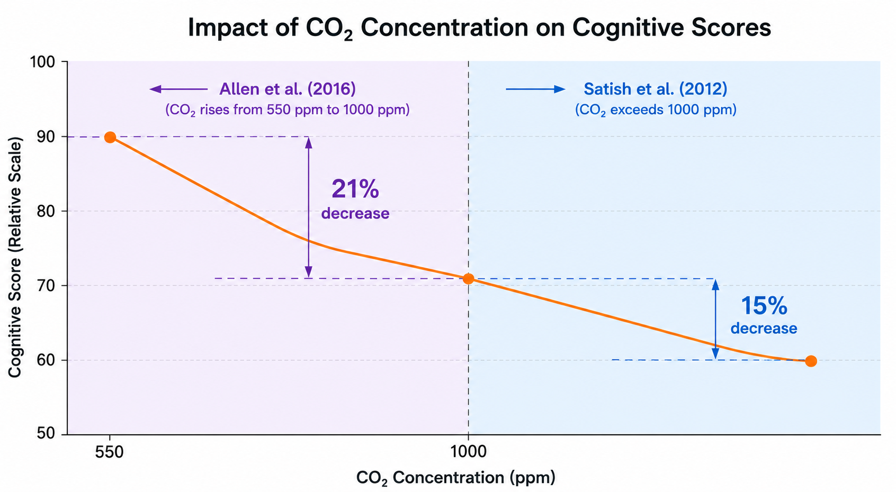
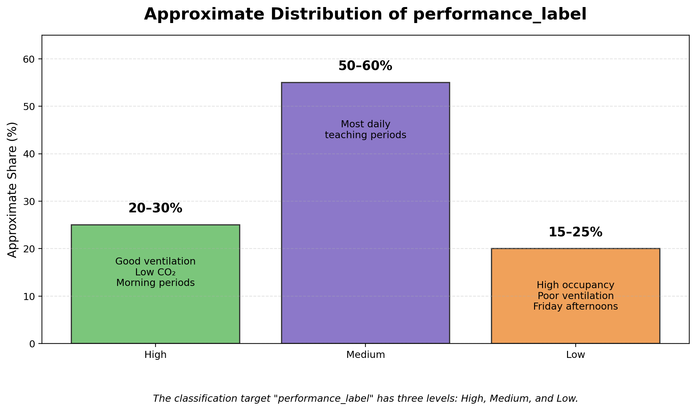

# AirMind: Predicting Student Performance Through Air Quality and Environmental Factors (Project Proposal)

## I. Domain and Motivation

### 1.1 Background
In recent years, indoor air quality's impact on student cognitive function has become an important research topic at the intersection of **environmental health science** and **educational technology**. Modern students spend over 90% of their time indoors, and classrooms are the primary learning environment. The air quality of classrooms directly affects teaching effectiveness and student health. According to the World Health Organization's 2025 report, approximately 34% of classrooms worldwide have varying degrees of air pollution, mainly including **carbon dioxide (CO₂)** and **fine particulate matter (PM2.5)**.

<b>Figure 1. Impact of CO₂ Concentration on Cognitive Scores</b>

- Satish et al. (2012) found that when **CO₂ concentration exceeds 1000 ppm**, students' decision-making scores may decrease by up to 🟠15%🟠;
- Allen et al. (2016) showed CO₂ rising from 550 ppm to 1000 ppm reduces cognitive scores by about 🟠21%🟠;
- Shaughnessy et al. (2006) demonstrated PM2.5 and VOCs significantly increase attention lapses and task error rates.

Despite these findings, classroom air regulation still relies on **teachers’ subjective judgment**, lacking real-time, data-driven decision support.

To address this problem, this project proposes building a **quantitative predictive model** linking classroom sensor data (**CO₂, PM2.5, temperature, humidity**) with students' cognitive performance. By simulating environmental dynamics over a week, the dataset reflects **nonlinear coupling**, **cumulative effects**, and **asymmetric intervention costs**.

Unlike traditional “threshold-triggered” rules, this project uses **machine learning** to uncover **high-order interactions** and **lag effects**, constructing a **deployable, interpretable prediction tool**.

### 1.2 Why This Problem is Important
Predicting air quality impact has three core scientific and educational values:

1. **Coupled Effects**: Students' cognitive performance is influenced by **CO₂, PM2.5, temperature, humidity** interactions. High temperature and humidity can amplify CO₂'s negative effect.
2. **Prediction with Asymmetric Intervention Costs**: Misclassifying **high-load environments** as normal (false negative) can lead to significant cognitive loss, whereas false positives incur minor energy/noise costs.
3. **Time-series Dynamics**: Exposure effects are **cumulative**, requiring **time-series modeling** to capture trends and persistence.

### 1.3 Unique Value of This Project
- **Predictive Capability**: Predicts **High, Medium, Low** cognitive levels 15–30 min ahead.  
- **Interpretability**: **SHAP values** quantify contribution of each environmental factor.  
- **System Prototype**: **Streamlit-based interactive tool** shows real-time predictions and recommendations.

## II. Dataset Description

### 2.1 Data Source
Dataset from Kaggle: **“Air Quality and Student Performance Dataset”** ([link](https://www.kaggle.com/datasets/uniquetech/air-quality-and-student-performance-dataset)).

Linked to **ACSTAC 2026 award-winning MLA Robot**. The robot monitors CO₂ and PM2.5, but cannot answer: *"How much does opening a window help learning?"* This dataset provides a **quantitative solution**, linking environmental data to learning outcomes.

### 2.2 Dataset Scale and Structure
- **2000 observations**, **200 students**, 5 school days, 5 periods/day.  
- Each record: environmental exposure, cognitive performance, static student features.

| Column | Type | Description |
|--------|------|-------------|
| student_id | int | Anonymous student ID (1–200) |
| day | int | School day (1=Mon, 5=Fri) |
| period | int | Period number (1–5) |
| co2_ppm | float | CO₂ (ppm), 400–2500 |
| pm25_ugm3 | float | PM2.5 (μg/m³), 5–150 |
| temperature_c | float | Room temp (°C), 18–32 |
| humidity_pct | float | Relative humidity (%), 20–80 |
| air_quality_label | string | Good / Moderate / Poor |
| quiz_score | float | Test score (0–100) |
| reaction_time_ms | float | Reaction time (ms) |
| focus_rating | int | Focus level (1–10) |
| error_rate | float | Errors per 10 tasks |
| heart_rate_bpm | float | Heart rate (bpm) |
| grade | int | Student grade (7–11) |
| age | int | Student age (12–17) |
| has_asthma | int | Asthma (0=no, 1=yes, ~12%) |
| subject | string | Subject (Math, Science, Language, etc.) |
| cognitive_impairment | float | Regression target 0.00–0.35 |
| performance_label | string | Classification target: High / Medium / Low |

### 2.3 Target Variable Distribution
- Regression: **cognitive_impairment** 0.00–0.35, right-skewed; extremes occur in high CO₂/PM2.5/temp.  
- Classification: distribution approx.

<b>Figure 2. Distribution of performance_label</b>

| Level | Approx. % | Notes |
|-------|------------|-------|
| High | 20–30% | Ventilated, low CO₂ periods |
| Medium | 50–60% | Routine periods |
| Low | 15–25% | Densely populated, poorly ventilated periods |

### 2.4 Data Format and Access
- CSV, UTF-8, ~200 KB  
- [Kaggle dataset link](https://www.kaggle.com/datasets/uniquetech/air-quality-and-student-performance-dataset)
- The Kaggle platform offers both **data exploration Notebooks** and **generation scripts**, which comprehensively demonstrate the simulation process from the dose-effect function in the literature to the final observation records, ensuring the transparency and reproducibility of the research.

### 2.5 Ethical Considerations

1. **Data Privacy**: Dataset is fully synthetic; no real student, teacher, or classroom personal information (PII) is involved.
2. **Simulation Limitations**: Cognitive performance is complex and influenced by sleep, nutrition, and psychological state. The study focuses only on environmental factors (air quality, temperature, humidity), representing a simplification. Model generalization in real-world scenarios requires further validation.
3. **Fairness and Potential Misuse**: The model aims to optimize classroom environments for better learning but must not be misused to assess or rank teachers/students.
4. **Research Integrity**: All conclusions are based on simulation with proper citations to original studies (Satish, Allen, Shaughnessy). All code and simulation configurations will be openly available for full reproducibility.

## III. Scientific Question

### 3.1 Core Scientific Question
This project aims to answer the following central research question:

> Can gradient boosting tree ensemble models, using multi-dimensional, multi-period cumulative classroom environmental monitoring data (**CO₂, PM2.5, temperature, humidity**) along with student background information, significantly improve the prediction accuracy of student cognitive performance levels (**High / Medium / Low**) compared to simple linear models or single-threshold rules? Additionally, can **SHAP model interpretation techniques** provide actionable, priority-ranked, and explainable intervention recommendations for classroom environmental management?

The precise definition includes:

- **Independent Variables (Feature Sets and Model Architecture)**  
  - **Feature Set A (Baseline)**: Only includes single-period environmental variables (e.g., **CO₂ concentration**) and simple threshold-based features.  
  - **Feature Set B (Extended)**: Includes all environmental factors, temporal context, and student background attributes. **Cumulative exposure features** are constructed based on class period sequences (e.g., average environmental values from previous periods).

- **Model Comparison**: Linear baseline models vs. tree-based ensemble models (e.g., **Gradient Boosting Trees**).

- **Dependent Variables (Evaluation Metrics)**:  
  - **Primary metrics**: Macro-average **F1 score** for classification tasks, emphasizing the high-risk **Low** category.  
  - **Regression metrics**: **RMSE** and **R²**.  
  - **Interpretability metrics**: SHAP feature importance ranking and **Partial Dependence Plots (PDPs)**.

- **Control Variables**:  
  - Training/validation/test splits by school day sequence (first 3 days for training, 4th for validation, 5th for testing).  
  - Unified data preprocessing (**standardization, missing value imputation, encoding**) and fixed random seed (**seed=42**).

### 3.2 Research Hypotheses
- **H1 (Primary Hypothesis)**: Using extended Feature Set B with tree-based ensemble models will achieve significantly higher macro-average F1 scores than baseline Feature Set A with linear models or simple threshold rules, with an expected improvement of at least **15%**.  
- **H2 (Secondary Hypothesis)**: **Cumulative CO₂ exposure features** from previous periods will rank highly in SHAP analysis, potentially contributing more than instantaneous CO₂ measurements, supporting the cumulative effect hypothesis.  
- **H3 (Exploratory Hypothesis)**: Temperature and humidity will interact with CO₂—under high temperature and humidity, CO₂’s negative impact on cognition is amplified.  
- **H4 (Deployment Feasibility Hypothesis)**: The **Streamlit prototype** will provide real-time predictions (<1 second) and Top-2 intervention suggestions, demonstrating feasibility for classroom decision support.

### 3.3 Theoretical Basis
- **H1 & H3**: Allen et al. (2016) indicate that multiple environmental factors have stronger combined effects than single factors. Gradient boosting trees capture **non-linear interactions** (e.g., high temperature + high CO₂ synergy), expected to outperform linear models.  
- **H2**: Cognitive impairment is influenced by **cumulative exposure**, not instantaneous readings; prior period averages are scientifically reasonable for modeling.  
- **H4**: MLA Robot has demonstrated **real-time edge inference feasibility**; Streamlit prototype provides an accessible interface showing quantified cognitive benefits and ranked interventions.

## IV. Preliminary Hypotheses & Expected Findings

### 4.1 Summary of Expected Results

| Hypothesis | Description | Expected Result | Theoretical Basis & Reasoning |
|------------|------------|----------------|-------------------------------|
| H1 | The ensemble model (**multi-feature + cumulative exposure**) will outperform rule-based or linear baseline models | Macro-average F1 score increase ≥ 0.15 | Non-linear models capture high-order interactions and cumulative effects. Simple threshold rules may misclassify high-risk periods when CO₂ drops due to breaks but attention is not fully restored. Ensemble models consider particulate matter, temperature, humidity, and trend data to improve classification accuracy and reduce false negatives. |
| H2 | **Cumulative CO₂ exposure features** will have high importance | SHAP importance ranking among top features | Students’ cognitive impairment after multiple high CO₂ periods remains elevated even if current-period CO₂ drops. Predictions rely on cumulative exposure. SHAP analysis visually demonstrates feature importance. |
| H3 | Temperature and humidity interact with CO₂ | SHAP dependence plots reveal interaction effects | SHAP plots show: (1) moderate temp/humidity → mild CO₂ effect; (2) high temp/humidity → large CO₂ effect. Supports the hypothesis that hot/humid environments amplify CO₂ impact and guide combined interventions (ventilation + temp/humidity control). |
| H4 | **Streamlit prototype** can provide predictions and Top-2 interventions in <1 second | Real-time feasibility demonstrated | Ensemble model has small parameter size; forward computation is fast. Streamlit provides predictions and Top-2 recommendations in <1 second, meeting real-time decision support requirements. |

### 4.2 Detailed Expectations and Reasoning

#### H1 Reasoning
Simple threshold rules may misclassify **high-risk periods** as normal, especially when CO₂ drops rapidly during breaks but student attention has not fully recovered. The ensemble model, considering **particulate matter, temperature, humidity, and environmental trends**, more accurately distinguishes cognitive states, improving classification accuracy and reducing high-cost false negatives.

#### H2 Reasoning
Students exposed to multiple high CO₂ periods retain elevated cognitive impairment even if current-period CO₂ drops. Predicting subsequent periods relies primarily on **cumulative exposure**, not instantaneous readings. SHAP analysis illustrates the relative importance of cumulative features.

#### H3 Reasoning
SHAP dependence plots are expected to show two typical patterns:  
1. Moderate temperature/humidity → CO₂ changes cause mild prediction differences.  
2. High temperature/humidity → CO₂ changes cause large prediction differences.  

This supports the hypothesis that **hot and humid conditions amplify CO₂’s negative cognitive effects**, informing combined interventions (ventilation + temperature/humidity control).

#### H4 Reasoning
The final ensemble model has a **limited parameter size** and extremely fast forward computation. Using **Streamlit**, the full workflow—from sensor input to cognitive level prediction and Top-2 interventions—can be completed in **<1 second**, meeting real-time classroom decision support requirements.

## V. Team Roles

The project team consists of **4 members**, covering the entire workflow from data simulation, feature engineering, model construction, interpretability analysis, to interactive prototype development.

| Member | Role | Core Responsibilities | Key Deliverables |
|--------|------|--------------------|-----------------|
| Geyi Zhu | **Data Engineer** | Data acquisition and exploratory data analysis; construct **temporal cumulative features** and environmental derived variables; perform chronological train/validation/test splits | Preprocessed feature sets, EDA report, data splitting scheme |
| Chang Sun | **Modeling Engineer** | Build linear baseline and **ensemble tree models**; perform hyperparameter optimization; output multi-model performance comparison | Model training code, performance comparison tables |
| Yujia Chen | **Evaluation Specialist** | Design **cost-sensitive evaluation schemes** (focus on high-risk Low class); multi-model comparison and visualization | Model evaluation report, comparison charts |
| Yinuo Sun | **XAI & Deployment Engineer** | Conduct **SHAP interpretability analysis** and visualization; develop **Streamlit interactive prototype**; integrate project documentation and code repository | SHAP visualizations, Demo application, final report |

---

## Appendix: Project Management and Milestones

| Milestone | Timeline | Key Deliverables | Responsible |
|-----------|---------|----------------|-------------|
| M1: Project Proposal | Week 1 | proposal.md (this document) | Yinuo Sun (integration), all members |
| M2: Data Reproduction & EDA | Weeks 2–3 | Python scripts for data generation, **EDA visualization report** | Geyi Zhu |
| M3: Baseline & Ensemble Models | Weeks 3–5 | Model training pipeline and performance benchmark report | Chang Sun |
| M4: Cost-Sensitive Evaluation & Optimization | Weeks 5–7 | Multi-model cost comparison and **best model selection report** | Yujia Chen |
| M5: Interpretability Analysis | Weeks 6–8 | **SHAP & PDP visualizations** (verify H2/H3) | Yinuo Chen |
| M6: Streamlit Deployment | Weeks 8–9 | Interactive **“Smart Classroom Advisor” Demo** | Yinuo Sun |
| M7: Final Report | Weeks 9–10 | Complete project report (**report.md**), slides/video | Yinuo Sun (integration), all members |

> **Note:** This project is based entirely on **public academic research** and simulation methods; no real human participants are involved. All code for **data generation, model training, and evaluation** will be openly hosted on GitHub to ensure full reproducibility.
