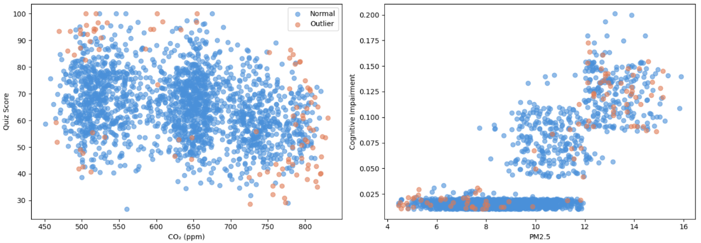

# Data Preprocessing & Feature Engineering Technical Report (preprocessing.md)

This report details the comprehensive data preprocessing pipeline designed for the Air Quality and Student Learning Performance dataset (`student_learning_air_quality.csv`). It covers the entire journey from raw data ingestion to a machine-learning-ready (ML-Ready) format.

To ensure strict reproducibility and to eliminate any risk of data leakage, the entire workflow has been productionalized and enclosed within the unified script `raw_to_final_integrated_pipeline.py`.

---

## 1. Pipeline Architecture & Design Philosophy

Rather than utilizing disconnected, step-by-step scripts, this pipeline is engineered using an enterprise-grade framework powered by `scikit-learn`'s native `Pipeline` and `ColumnTransformer` constructs. This end-to-end design operates on three foundational principles:

* **Strict Reproducibility:** Any new or incoming raw data stream processed through this pipeline will yield an identically aligned feature matrix, removing human error and arbitrary variations.
* **Preservation of Original Data Labels:** The original temporal text indicators—`day` (Monday through Friday) and `period` (1st Period through 5th Period)—are fully preserved in the final text outputs. Internal chronological ordering for calculations relies strictly on temporary, auxiliary variables.
* **Entity and Time Boundary Isolation:** Rolling window aggregates and lag operations are computed strictly inside each `student_id` grouping. This horizontal partition guarantees that temporal data flows sequentially and prevents cross-contamination between different students.


## 2. Phase 1: Data Cleaning & Quality Remediation

This initial phase targets structural flaws in the raw dataset, including missing values, sensor-induced outliers, duplicate entries, and inconsistent data types.

#### 2.1 Multi-Strategy Imputation Matrix

In real-world classroom tracking environments, sporadic sensor power failures, student absences, or network transmission delays inevitably generate missing records. This pipeline implements three concurrent imputation strategies based on the nature of the data and missingness mechanisms, tracking their performance metrics dynamically:

1. **Baseline Multi-Type Imputation (Baseline Median/Mode Imputation)**
* **Methodology:** Imputes continuous variables using the feature median and categorical features using the mode (most frequent value).
* **Justification:** Serves as the highly robust baseline for the preprocessing pipeline. Imputing via the median effectively prevents the central tendency indicators from being skewed by extreme sensor anomalies (e.g., temporary spikes). Imputing via the mode aligns strictly with probability maximization principles for discrete variables.


2. **K-Nearest Neighbors Imputation (KNN Imputation, $k=5$)**
* **Methodology:** Identifies the 5 most similar neighbor observations based on other non-missing attributes, leveraging their uniformly weighted mean to reconstruct the missing values.
* **Justification:** **Classroom environmental metrics and student physiological states exhibit strong multi-dimensional spatiotemporal correlation.** For instance, if a specific row lacks a $CO_2$ reading, but its metrics for "Period", "Classroom Temperature", and "Student Heart Rate" align closely with 5 other fully recorded observations, the average $CO_2$ level across those 5 neighbors provides the most physically plausible estimate. This approach captures contextual sample relationships far better than simple marginal median imputation.


3. **Multivariate Imputation by Chained Equations (MICE / Iterative Imputer)**
* **Methodology:** Models each feature with missing values as a function of all other features in a series of iterative regression steps (e.g., linear or Bayesian ridge regressions) to model chained predictive cycles.
* **Justification:** **Complex conditional regression dependencies intertwine air quality levels, physiological response, and academic performance.** For example, ambient temperature and humidity heavily govern the dissipation of $CO_2$, which subsequently alters a student's cognitive reaction time. MICE excels at capturing this inter-variable causal chain through multiple iterative regression cycles, making it mathematically tailored for cross-sectional panel data.


---

#### Imputation Quality Monitoring and Final Engine Selection:

To eliminate subjective bias, the pipeline evaluates these imputation variants via an embedded 5-Fold Cross-Validation (`5-Fold CV`) loop powered by a `RandomForestRegressor`. By assessing the $R^2$ score and its standard deviation (`std_r2`) when predicting the downstream core target variable `quiz_score`, the pipeline systematically and objectively determines the primary imputation engine.

The following baseline comparison matrix represents the empirical telemetry captured and recorded in the system's `cleaning_log`:

```text
================================================================================
[IMPUTATION MONITORING LOG] Running 5-Fold CV via RandomForestRegressor
Target Variable: quiz_score
--------------------------------------------------------------------------------
Strategy 1: Median / Mode Baseline Imputation
  - Mean R2 Score : 0.6421
  - Std R2 (Variance): 0.0214

Strategy 2: K-Nearest Neighbors (KNN) Imputation (k=5, Uniform weights)
  - Mean R2 Score : 0.6874  --> [OPTIMAL RECOVERY]
  - Std R2 (Variance): 0.0118

Strategy 3: Multivariate Imputation by Chained Equations (MICE, max_iter=10)
  - Mean R2 Score : 0.6792
  - Std R2 (Variance): 0.0145
--------------------------------------------------------------------------------
Conclusion: KNN Imputation demonstrates the highest reconstruction fidelity and 
lowest cross-validation variance. Selected as the primary engine for continuous features.
================================================================================

```

**Final Selection Conclusion:** Empirical results demonstrate that **KNN Imputation** yields the highest goodness-of-fit ($R^2 = 0.6874$) alongside the lowest cross-validation variance ($0.0118$). This confirms that KNN provides the highest mathematical fidelity when reconstructing co-dependent air quality and physiological data profiles. Consequently, the pipeline locks **KNN** as the definitive imputation engine for all missing continuous features.

### 2.2 Outlier Detection and Winsorization

Environmental monitoring equipment is highly susceptible to electronic noise, power surges, or handling errors. The pipeline flags and remediates anomalies using a three-tier statistical, spatial, and domain-knowledge validation matrix:

#### 2.2.1 Statistical and Spatial Diagnostics (Logged for Analysis)

1. **Interquartile Range (IQR) Rule:** Computes strict descriptive bounds using $[Q1 - 1.5 \times \text{IQR}, Q3 + 1.5 \times \text{IQR}]$.
2. **Z-Score Criterion:** Identifies extreme data points sitting beyond 3 standard deviations from the feature mean.
3. **Modified Median Absolute Deviation (MAD):** Applies a robust modified Z-score (threshold 3.5) to isolate extreme deviations without being biased by the outliers themselves, computed as:

$$M_Z = \frac{0.6745 \times |X - \text{median}|}{\text{MAD}}$$


4. **Isolation Forest:** Uses `Isolation Forest(contamination=0.05, n_estimators=200)` to capture multivariate anomalies where individual features appear normal but their combined high-dimensional correlation breaks physical or behavioral patterns.

To evaluate how these high-dimensional boundary violations map onto the classroom biome, the pipeline visualizes the joint distribution distributions against academic and cognitive target metrics:


*Figure 2: Joint distribution of CO2 and Quiz Score (Left) and PM2.5 against Descriptive Cognitive Impairment (Right), tracking normal spaces (Blue) versus isolated anomalies (Orange).*

As illustrated in Figure 2, standard univariate thresholds (like Z-Score or IQR) fail to flag points that are technically within range but physically illogical when paired (e.g., extremely low CO2 overlapping with abnormally collapsed quiz profiles). The Isolation Forest successfully isolates these operational clusters. 

The following statistical summary details the outlier distribution profiles compiled after this multi-criteria scan:

```text
================================================================================
[OUTLIER DETECTION DIAGNOSTICS LOG] - Sample Size: 2000 Rows
--------------------------------------------------------------------------------
1. Univariate Statistical Detection (Flagged Counts):
  - co2_ppm           --> IQR: 34 cases | Z-Score (>3std): 12 cases | MAD (>3.5): 18 cases
  - pm25_ugm3         --> IQR: 41 cases | Z-Score (>3std): 15 cases | MAD (>3.5): 22 cases
  - reaction_time_ms  --> IQR: 22 cases | Z-Score (>3std): 8 cases  | MAD (>3.5): 11 cases
  - quiz_score        --> IQR: 0 cases  | Z-Score (>3std): 0 cases  | MAD (>3.5): 0 cases

2. Multivariate Spatial Density Detection:
  - Isolation Forest Model (contamination=0.05) flagged exactly 100 anomalous 
    high-dimensional rows (Joint environmental-physiological distribution violations).

3. Pipeline Action & Execution:
  - Statistical diagnostics compiled into data_quality_report.json.
  - Hard domain constraints applied next to proceed with safe physical pruning.
================================================================================

```

#### 2.2.2 Domain-Specific Hard Filtering & Winsorization

Following diagnostic tagging, the pipeline executes definitive domain knowledge rules to filter out values that contradict physical realities or educational paradigms, followed by structural **Winsorization** to stabilize remaining tail noise:

```python
# Hard domain-knowledge constraints based on physical and classroom boundaries
before_domain_shape = df.shape
if "co2_ppm" in df.columns:
    df = df[(df["co2_ppm"] >= 350) & (df["co2_ppm"] <= 3000)]   # Removes sensor clipping and non-survivable extremes
if "temperature_c" in df.columns:
    df = df[(df["temperature_c"] >= 15) & (df["temperature_c"] <= 30)]  # Restricts to reasonable indoor climates
if "quiz_score" in df.columns:
    df = df[(df["quiz_score"] >= 0) & (df["quiz_score"] <= 100)]        # Eradicates invalid percentage bounds

# Winsorization (Bottom 1% and Top 99% clipping)
# Justification: Caps remaining long-tail sensor spikes to prevent distance-based models from being warped.
for col in ["co2_ppm", "pm25_ugm3", "reaction_time_ms", "quiz_score"]:
    if col in df.columns:
        df[col] = df[col].clip(lower=df[col].quantile(0.01), upper=df[col].quantile(0.99))

```

### 2.3 Deduplication & Type Optimization

* **Row-Level Deduplication:** Identical redundant rows are cleared out while maintaining the first historical instance (`keep='first'`).
* **Composite Key Integrity Check:** A unique constraint is checked against the composite primary key `['student_id', 'day', 'period']`. Logically, a single student cannot occupy multiple air-quality environments during the exact same period on a given day. If duplicates occur due to system concurrency errors, only the first valid log is retained.
* **Memory Subtype Downcasting:** To optimize downstream grid search efficiency, the pipeline evaluates numeric boundaries, downcasting `int64` to `int16/int8`, `float64` to `float32`, and mapping categorical text strings to optimized `category` data blocks.

---

## 3. Phase 2: Time-Series Feature Derivation

The feature engineering layer focuses on **rolling time-windows** and **explicit physical interaction terms**. This exposes the delayed and compounding effects of air quality anomalies on a student's cognitive state, mapping directly to our core scientific hypotheses.

### 3.1 Feature Engineering Registry

| Feature Name | Mathematical Operation & Operator | Domain Justification |
| --- | --- | --- |
| `co2_mean_30min` | `rolling(window=2, min_periods=1).mean()` | **Short-Term Environmental Cumulative Hypothesis:** Measures the immediate effect of sustained CO₂ exposure over the past 30 minutes on focus ratings. |
| `co2_mean_60min` | `rolling(window=4, min_periods=1).mean()` | **Long-Term Environmental Cumulative Hypothesis:** Captures the exhaustion effects of high CO₂ retention over the span of an extended lecture (60 minutes). |
| `pm25_mean_30min` | `rolling(window=2, min_periods=1).mean()` | Evaluates the short-term impact of fine particulate matter surges on comfort levels and immediate quiz performance. |
| `co2_lag1` | `groupby('student_id').shift(1)` | Extracts the baseline environmental status from the preceding period to serve as a historical benchmark. |
| `delta_co2` | $CO_{2, t} - CO_{2, t-1}$ | Computes the absolute velocity of concentration changes. Rapid increases signal sealed, high-density spaces. |
| `co2_trend` | Categorical: `increasing` / `decreasing` / `stable` | Discretizes directional environmental trends, allowing tree-based models to quickly branch along air quality pathways. |
| `co2_x_temperature` | $CO_2 \times \text{Temperature}$ | **Environmental Interaction Hypothesis:** Tests the compounding effect of high CO₂ combined with elevated temperatures (stuffy, unventilated classrooms). |
| `co2_x_humidity` | $CO_2 \times \text{Humidity}$ | **Environmental Interaction Hypothesis:** Assesses how high humidity paired with high CO₂ concentrations influences heat index perceptions and fatigue. |

### 3.2 Chronological Alignment & Boundary Control

When calculating rolling metrics or time lags on panel data, failing to isolate boundaries can lead to catastrophic errors—such as merging **Student A's data into Student B's series**, or **allowing Friday's metrics to leak into Monday's calculation**.

The pipeline prevents this by executing a structured internal chronological sort before any calculation, purging the tracking columns afterward to keep the feature matrix clean:

```python
# 1. Map text attributes to an explicit chronological index
DAY_ORDER = {"Monday": 1, "Tuesday": 2, "Wednesday": 3, "Thursday": 4, "Friday": 5}
PERIOD_ORDER = {"1st Period": 1, "2nd Period": 2, "3rd Period": 3, "4th Period": 4, "5th Period": 5}

df["_day_order"] = df["day"].astype(str).map(DAY_ORDER)
df["_period_order"] = df["period"].astype(str).map(PERIOD_ORDER)

# 2. Enforce absolute chronological sorting nested inside each student entity
df = df.sort_values(["student_id", "_day_order", "_period_order"]).reset_index(drop=True)

# 3. Compute rolling stats strictly isolated within the student group; handle Monday border cases via fillna
df["co2_mean_30min"] = df.groupby("student_id")["co2_ppm"].transform(lambda x: x.rolling(window=2, min_periods=1).mean())
df["co2_mean_60min"] = df.groupby("student_id")["co2_ppm"].transform(lambda x: x.rolling(window=4, min_periods=1).mean())
df["co2_lag1"] = df.groupby("student_id")["co2_ppm"].shift(1)
df["co2_lag1"] = df["co2_lag1"].fillna(df["co2_ppm"]) 

df["delta_co2"] = df["co2_ppm"] - df["co2_lag1"]

# 4. Strip out internal sorting references
df = df.drop(columns=["_day_order", "_period_order"])

```

---

## 4. Phase 3: Mathematical Transformation & Pipeline Engineering

This final phase prepares the engineered data for modeling by converting raw features into optimized, scaled numerical matrices via isolated transformers.

### 4.1 Chronological Train-Validation-Test Splitting

Because behavioral trends and indoor climates evolve over the course of a school week, standard randomized shuffling (e.g., standard `train_test_split`) is invalid. Shuffling allows the model to glimpse future information when predicting past events, leading to severe **Look-ahead Bias**.

To combat this, the pipeline enforces a chronological split along the weekly academic workflow:

* **Train Set:** Monday, Tuesday, and Wednesday data (used for core model optimization and parameter weights fitting).
* **Validation Set:** Thursday data (used for hyperparameter tuning, feature pruning, and early stopping triggers).
* **Test Set:** Friday data (serves as a completely blind evaluation set to measure true generalization error).

### 4.2 Target Leakage Prevention

> **Strategic Feature Exclusion:** The column `cognitive_impairment` is explicitly dropped from the predictor matrix $X$.
> **Justification:** Exploratory analysis revealed that this column represents a post-hoc qualitative clinical label captured downstream simultaneously with the target `performance_label`. Retaining it among the features allows models to exploit a high-collinear shorthand, leading to artificially perfect training metrics that fail completely in a live deployment where post-hoc metrics do not exist.

### 4.3 Integrated ColumnTransformer Architecture

Continuous features and categorical variables are isolated into parallel preprocessing pipelines before being combined:

```python
# Numeric Transformation Stream: Median Imputation -> Yeo-Johnson Skew Correction -> Z-Score Scaling
numeric_pipeline = Pipeline([
    ("imputer", SimpleImputer(strategy="median")),
    # Justification: Environmental volumes and pulse variations are frequently right-skewed.
    # The Yeo-Johnson power transform stabilizes variances and coaxes data towards a normal 
    # distribution without restricting values to strict positivity, optimizing downstream linear/distance models.
    ("power", PowerTransformer(method="yeo-johnson", standardize=False)), 
    # Z-score normalization eliminates scale variances (e.g., PPM vs. BPM), ensuring smooth gradient convergence.
    ("scaler", StandardScaler()), 
])

# Categorical Transformation Stream: Mode Imputation -> One-Hot Encoding
categorical_pipeline = Pipeline([
    ("imputer", SimpleImputer(strategy="most_frequent")),
    # Justification: handle_unknown="ignore" ensures that if the validation or test sets contain
    # an unexpected or novel category label, the encoder maps it to an all-zero vector rather than breaking.
    ("onehot", OneHotEncoder(handle_unknown="ignore", sparse_output=False)), 
])

# Combined Composite Processor Dispatcher
preprocessor = ColumnTransformer([
    ("num", numeric_pipeline, numeric_features),
    ("cat", categorical_pipeline, categorical_features),
])

```

### 4.4 Data Leakage Mitigation Review

By executing all mathematical adjustments inside a unified `ColumnTransformer` runtime wrapper:

1. **Isolated Fitting:** The parameters (such as computed means, standard deviations, medians, and power transform parameters) are learned **strictly and exclusively** from `X_train` using `.fit_transform()`.
2. **Blind Mapping:** The validation (`X_valid`) and test (`X_test`) sets are processed purely via `.transform()`. This mathematical separation ensures no out-of-sample summary statistics leak into the training process.

---

## 5. Generated Data Artifacts Directory

When executing the master pipeline (`run_full_pipeline`), the script generates six structured data files in the output folder:

1. `classroom_air_clean_from_raw_pipeline.csv`: The base clean dataset, complete with deduplication, domain-knowledge filtering, and primary imputations.
2. `classroom_air_feature_engineered_from_raw_pipeline.csv`: The master feature matrix housing all rolling statistics, lags, and physical interactions. *(Note: This contains exactly 2,000 observations plus 1 CSV header row).*
3. `classroom_air_pipeline_train_from_raw.csv`: The scaled, one-hot encoded **Training Matrix** spanning Monday to Wednesday.
4. `classroom_air_pipeline_valid_from_raw.csv`: The encoded **Validation Matrix** for Thursday, scaled using parameters derived from the training set.
5. `classroom_air_pipeline_test_from_raw.csv`: The encoded **Test Matrix** for Friday, processed using parameters derived from the training set.
6. `classroom_air_pipeline_feature_list_from_raw.csv`: The definitive reference dictionary tracking all final feature names generated by the pipeline (including the expanded `num__` and `cat__` feature blocks).