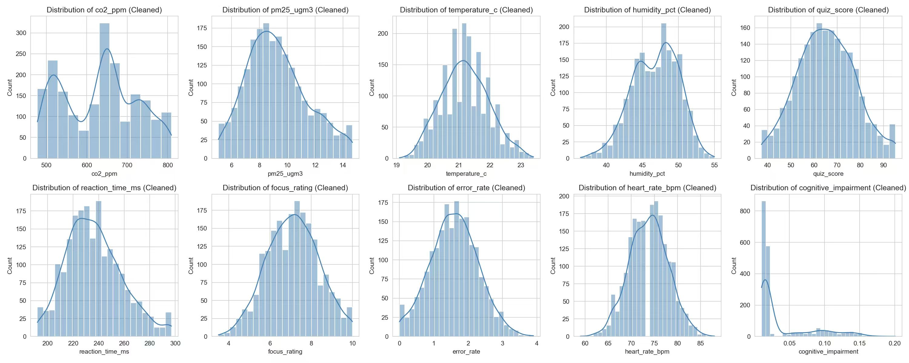
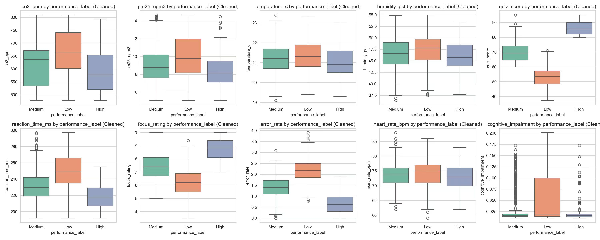
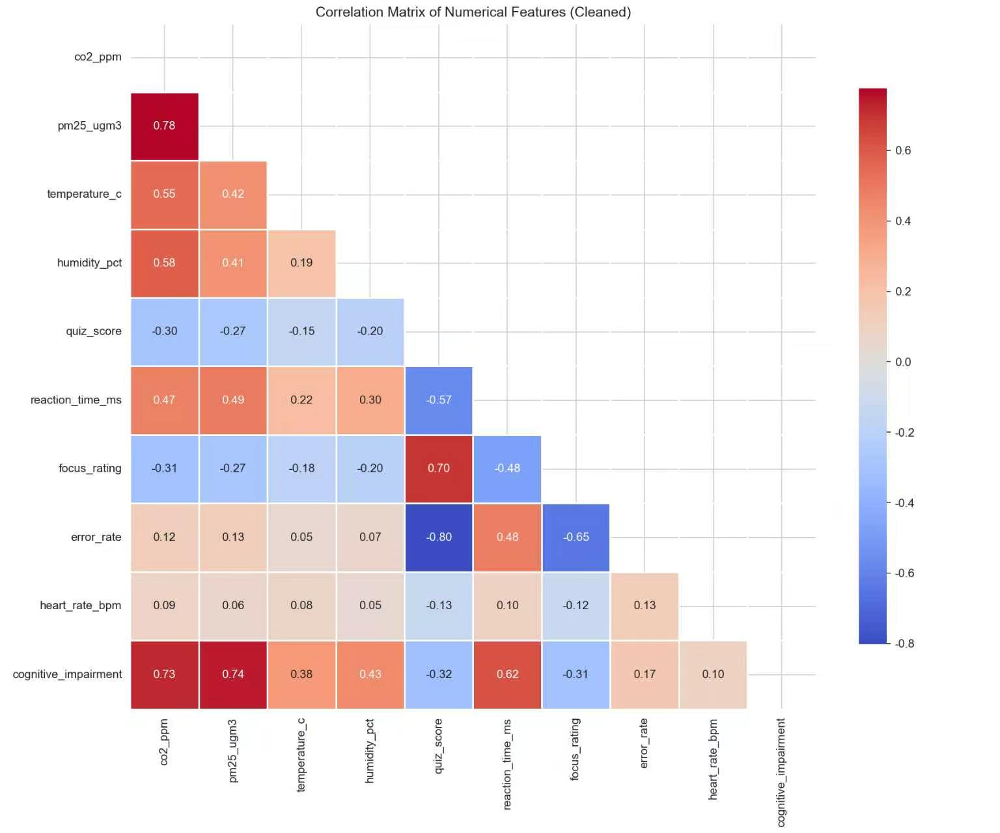
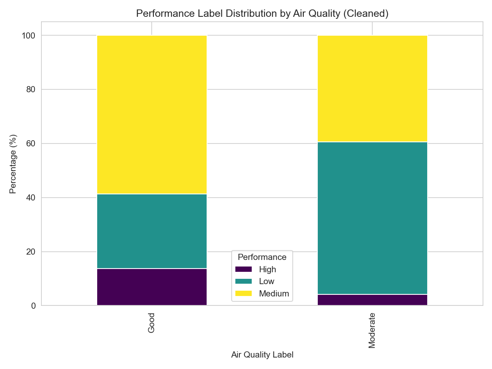

## 1. Dataset Overview

- **Raw dataset**: `raw_classroom_air.csv`, 2000 rows × 19 columns.
- **Cleaned dataset**: `cleaned_classroom_air.csv`, 2000 rows × 20 columns (with added `iso_outlier` flag column).
- **Data nature**: Synthetic dataset, designed to simulate classroom environment and student performance.

## 2. Missing Value Proportion

No missing values were found in the raw data. All fields are complete, with a missing rate of 0%.

> The raw data missing value summary table is empty, confirming no missing values.  
> No imputation or deletion was performed during cleaning.

## 3. Data Schema

The cleaned dataset contains 20 fields. Details are as follows:

| Field Name              | Data Type | Example Value   | Description                                      |
|-------------------------|-----------|-----------------|--------------------------------------------------|
| student_id              | object    | STU0001         | Unique student identifier                        |
| day                     | object    | Friday          | Day of the week                                  |
| period                  | object    | 1st Period      | Class period                                     |
| subject                 | object    | Mathematics     | Subject name                                     |
| grade                   | object    | Grade 11        | Grade level                                      |
| age                     | float64   | 14.0            | Age (years)                                      |
| has_asthma              | int64     | 1               | Asthma status (1=yes, 0=no)                      |
| co2_ppm                 | float64   | 504.4           | Carbon dioxide concentration (ppm)               |
| pm25_ugm3               | float64   | 8.61            | PM2.5 concentration (µg/m³)                      |
| temperature_c           | float64   | 21.3            | Temperature (°C)                                 |
| humidity_pct            | float64   | 45.3            | Relative humidity (%)                            |
| air_quality_label       | object    | Good            | Air quality label (Good/Moderate)                |
| quiz_score              | float64   | 74.9            | Quiz score (0–100)                               |
| reaction_time_ms        | int64     | 245             | Reaction time (ms)                               |
| focus_rating            | float64   | 8.2             | Focus rating (0–10)                              |
| error_rate              | float64   | 1.59            | Error rate (%)                                   |
| heart_rate_bpm          | float64   | 67.0            | Heart rate (bpm)                                 |
| cognitive_impairment    | float64   | 0.0108          | Cognitive impairment index (synthetic)           |
| performance_label       | object    | Medium          | Performance label (Low/Medium/High)              |
| iso_outlier             | int64     | 1               | IQR‑based outlier flag (1=outlier)               |

> `iso_outlier` is an engineered feature and does not affect the core cleaned data.

## 4. Class Distribution Balance

### 4.1 Target Variable `performance_label`

| Class  | Frequency | Percentage |
|--------|-----------|------------|
| Medium | 1070      | 53.5%      |
| Low    | 706       | 35.3%      |
| High   | 224       | 11.2%      |

- **Imbalance ratio**: Largest class (Medium) to smallest class (High) = 1070/224 ≈ **4.78**.
- **Conclusion**: Moderate imbalance exists – the “High” class is underrepresented. Stratified sampling or class weighting is recommended for modeling.

### 4.2 Other Key Categorical Variables

| Variable              | Distribution Summary                                                                 |
|-----------------------|---------------------------------------------------------------------------------------|
| `air_quality_label`   | Good (1465, 73.25%), Moderate (535, 26.75%)                                           |
| `has_asthma`          | 0 (1776, 88.8%), 1 (224, 11.2%)                                                       |
| `subject`             | Mathematics (406), Biology (406), Physics (405), History (397), English (386) – balanced |
| `period`              | 1st Period (406), 3rd Period (406), 2nd Period (405), 4th Period (397), 5th Period (386) |
| `grade`               | Grade 10 (495), Grade 7 (422), Grade 11 (372), Grade 9 (359), Grade 8 (352)           |

All categorical variables are well‑balanced except for `performance_label`.

## 5. Outlier Treatment

### 5.1 Outlier Detection Method

We applied the **IQR (interquartile range) rule**: values below Q1 – 1.5×IQR or above Q3 + 1.5×IQR are considered outliers. Additionally, domain knowledge was used to check physically plausible ranges.

### 5.2 IQR‑based Outlier Counts

| Field                 | Outlier Count | Outlier Ratio |
|-----------------------|---------------|----------------|
| age                   | 0             | 0.00%          |
| has_asthma            | 224           | 11.20%         |
| co2_ppm               | 0             | 0.00%          |
| pm25_ugm3             | 0             | 0.00%          |
| temperature_c         | 5             | 0.25%          |
| humidity_pct          | 2             | 0.10%          |
| quiz_score            | 0             | 0.00%          |
| reaction_time_ms      | 31            | 1.55%          |
| focus_rating          | 1             | 0.05%          |
| error_rate            | 6             | 0.30%          |
| heart_rate_bpm        | 3             | 0.15%          |
| cognitive_impairment  | 193           | 9.65%          |
| iso_outlier           | 100           | 5.00%          |

> The high outlier ratios for `has_asthma` and `cognitive_impairment` are due to the data generation logic (binary / skewed distributions), not data entry errors.

### 5.3 Domain‑Knowledge Plausibility Check

| Field          | Plausible Range | Outside Count | Action |
|----------------|-----------------|---------------|--------|
| CO₂ (ppm)      | [350, 3000]     | 0             | Keep   |
| PM2.5 (µg/m³)  | [0, 500]        | 0             | Keep   |
| Temperature (°C)| [-10, 50]       | 0             | Keep   |
| Humidity (%)   | [0, 100]        | 0             | Keep   |

All values lie within physically reasonable ranges.

### 5.4 Outlier Handling Strategy

- **No outliers were removed**: Because the data is synthetic, extreme values may represent realistic extreme classroom conditions (e.g., high CO₂ or very low humidity). Deleting them would break the simulation integrity.
- **Flag column added**: `iso_outlier` records IQR‑based outlier status, allowing downstream models to test sensitivity to outliers.
- **Rationale**: Follow the principle of “keep extremes in synthetic data” – do not treat simulator assumptions as measurement errors.

## 6. Dataset Limitations

Since this is a **synthetic dataset**, all variable relationships are based on predefined simulation rules. Therefore:

- Observed statistical correlations (e.g., between CO₂ and quiz_score) **cannot be generalized to real classroom environments**.
- This data quality report only validates internal consistency of the simulator, not real‑world causal relationships.
- Modeling conclusions should be interpreted as **“consistency checks of simulator assumptions”** , not as evidence for actual educational or environmental interventions.

## 7. Generated Visualizations

The cleaned data produced the following charts to support data quality understanding:

- `histograms_cleaned.png` – Histograms of numerical variables  
  

- `boxplots_by_performance_cleaned.png` – Boxplots grouped by performance label  
  

- `correlation_heatmap_cleaned.png` – Correlation heatmap of numerical variables  
  

- `airquality_vs_performance_cleaned.png` – Bar chart of air quality vs. performance label  
  

